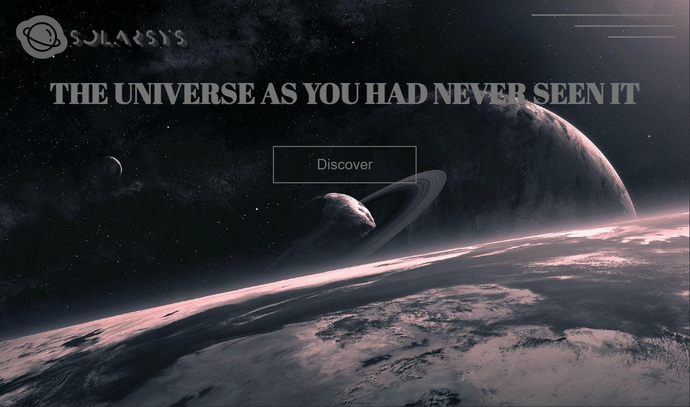

# SolarSys
## table des matières
1. [Info général](#Info-général)
2. [Technologies](#technologies)
3. [Auteur](#Auteur)
### Info général
***
Ceci est projet commencé en première année de licence informatique et repris 2 ans plus tard, je voulais faire un site sur un sujet que j'aime donc l'espace et plus particulièrement le système solaire.

Ce site vitrine informatif est constitué d'une page d'accueil contenant 4 grandes sections qui sont:

- planètes
- Satellites
- Asteroides
- Contact

Les 3 premières sections renvoient sur une page de catalogue qui affiche chaque élément de la section (ex: Pour les planètes cela donnera comme sur la 5e capture d'écran).

### Captures d'écran

## Technologies
***
Voici la liste des technologies utilisés dans le projet :
* [HTML](https://en.wikipedia.org/wiki/HTML): Version 5.2
* [CSS](https://en.wikipedia.org/wiki/CSS): Version 2.1
* [JS](https://en.wikipedia.org/wiki/JavaScript): Version ECMA-262
* [PHP](https://www.php.net/downloads.php): Version 8.1
* [LIBRAIRIE AJAX](https://example.com): Version 3.5.1
## Auteur
***
Dubroca nicolas [@Nicos65](https://github.com/Nicos65)
 
